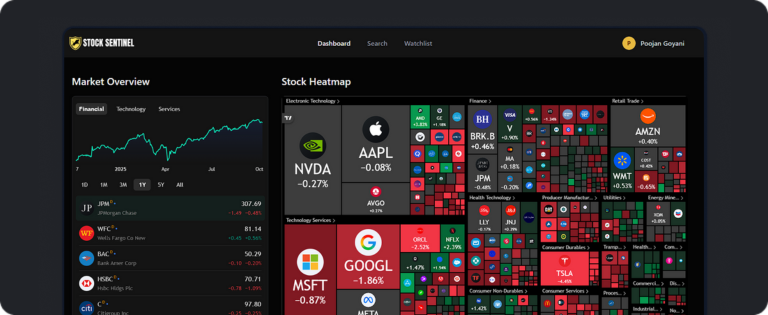
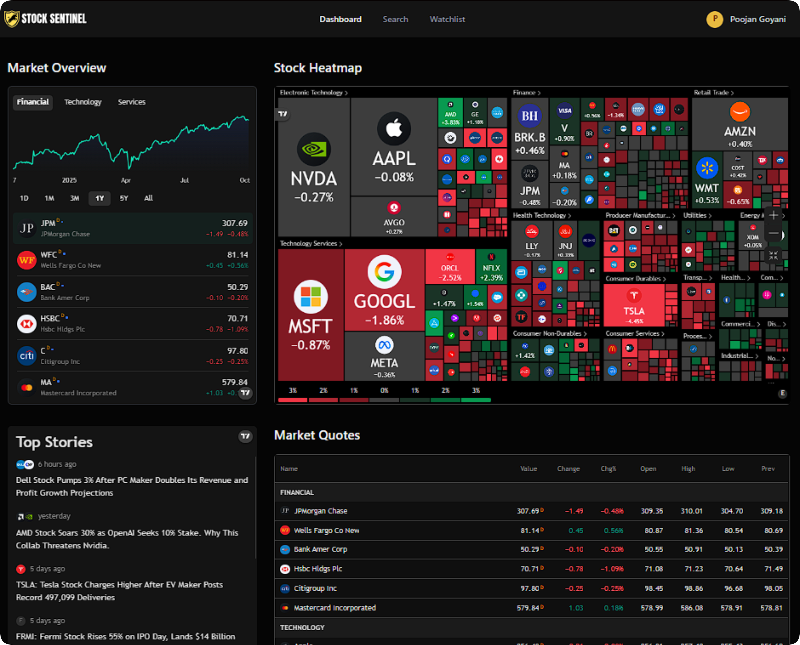

# 📈 Signalist - Stock Market Intelligence Platform

[](https://github.com/Poojan38380/StockSentinel)
[](https://github.com/Poojan38380/StockSentinel)
[](https://github.com/Poojan38380/StockSentinel/issues)
[](https://github.com/Poojan38380/StockSentinel/blob/main/LICENSE)
[](https://stock-sentinel-umber.vercel.app/)
[](https://nextjs.org/)
[](https://reactjs.org/)
[](https://www.mongodb.com/)

> **Your Personal Stock Market Command Center - Track, Analyze, and Stay Ahead**

I created Signalist because I wanted a comprehensive, real-time platform that not only tracks stock prices but provides intelligent insights and personalized alerts. As someone passionate about both finance and technology, I envisioned a tool that would make professional-grade stock analysis accessible to everyone through an intuitive, data-rich interface.

## ✨ What I Built

Signalist is a **full-stack stock market intelligence platform** that empowers investors with real-time data, advanced analytics, and AI-powered insights. Built with modern web technologies, it combines the power of TradingView's professional charting tools, real-time market data from Finnhub, and intelligent automation to create a seamless investing experience.

### 🎯 Key Features I Implemented

#### 📊 **Real-Time Market Analytics**
- **Interactive Dashboard**: Live market overview, stock heatmaps, and top movers
- **Advanced Charting**: Professional-grade candlestick and baseline charts powered by TradingView
- **Technical Analysis**: Real-time technical indicators and trading signals
- **Market Quotes**: Up-to-the-minute price data with change percentages

#### 🔍 **Intelligent Stock Search**
- **Smart Search**: Lightning-fast stock symbol and company name search
- **Global Coverage**: Search stocks from major exchanges worldwide
- **Instant Watchlist Actions**: Add stocks to your watchlist directly from search results
- **Keyboard Navigation**: Full keyboard shortcuts support (Cmd/Ctrl+K)

#### 📋 **Smart Watchlist Management**
- **Personalized Tracking**: Monitor your favorite stocks in one place
- **Real-Time Updates**: Live price, change percentage, market cap, and P/E ratios
- **Visual Indicators**: Color-coded gains/losses for quick insights
- **News Feed Integration**: Latest news for all your watchlist stocks
- **One-Click Actions**: Quick add/remove from any page

#### 📰 **AI-Powered News & Insights**
- **Daily News Summaries**: Automated AI-generated market summaries delivered to your inbox
- **Watchlist-Specific News**: Curated news for stocks you're tracking
- **Smart Aggregation**: News from multiple sources with relevance ranking
- **Visual News Cards**: Beautiful grid layout with images, sources, and timestamps

#### 🔔 **Smart Notifications (Coming Soon)**
- **Price Alerts**: Get notified when stocks hit your target prices
- **Email Notifications**: Daily market summaries and personalized insights
- **Custom Triggers**: Set up alerts based on your investment strategy

#### 👤 **Personalized Experience**
- **User Profiles**: Customize your investment preferences during sign-up
- **Investment Goals**: Tailored experience based on your goals (Growth, Income, Balanced)
- **Risk Tolerance**: Content and recommendations matched to your risk profile
- **Country-Specific Settings**: Localized market data and news

#### 📈 **Detailed Stock Analysis**
- **Company Profile**: Comprehensive company information and fundamentals
- **Financial Metrics**: P/E ratio, market cap, and key financial indicators
- **Historical Charts**: Multiple chart types for technical analysis
- **Performance Tracking**: Monitor stock performance over different timeframes

#### 🔐 **Secure Authentication**
- **Better Auth Integration**: Modern, secure authentication system
- **Email & Password**: Simple sign-up and sign-in process
- **Session Management**: Secure cookie-based sessions
- **User Data Protection**: MongoDB-backed secure data storage

## 🚀 Live Demo

[](https://stock-sentinel-umber.vercel.app/)

*Experience real-time market intelligence at your fingertips*

## 📸 Screenshots

<div align="center">
  
  <p><em>Real-time market overview with heatmaps and live data</em></p>
</div>

<div align="center">
  
  <p><em>Personalized watchlist with live prices and news</em></p>
</div>

## 🛠️ Technical Stack I Used

### Frontend Architecture
- **Next.js 15.5.4** - Latest React framework with App Router and Server Components
- **React 19.1.0** - Modern React with concurrent features
- **TypeScript** - Type-safe development with full IntelliSense support
- **Tailwind CSS 4** - Utility-first CSS with modern design system
- **Radix UI** - Accessible, unstyled component primitives
- **Lucide React** - Beautiful & consistent icon library

### Backend & Database
- **Next.js API Routes** - Serverless API endpoints with edge runtime support
- **MongoDB** - NoSQL database for flexible data storage
- **Mongoose** - Elegant MongoDB object modeling
- **Better Auth** - Modern authentication with email/password support

### State Management & Forms
- **React Hook Form** - Performant form validation and management
- **Sonner** - Beautiful toast notifications
- **cmdk** - Command palette for keyboard navigation

### External APIs & Data
- **Finnhub API** - Real-time stock quotes, news, and company data
- **TradingView Widgets** - Professional charting and technical analysis
- **Inngest** - Event-driven workflows for automated tasks

### AI & Automation
- **Inngest AI** - AI-powered email generation with Gemini
- **Nodemailer** - Email delivery for notifications and summaries
- **Scheduled Jobs** - Daily news summaries via cron expressions

### Development Tools
- **ESLint** - Code quality and consistency enforcement
- **Turbopack** - Next-generation bundler for faster builds
- **PostCSS** - Advanced CSS processing

## 🎨 Design Philosophy

I designed Signalist with **professional traders and casual investors** in mind:

- **Data-First Design**: Information-dense layouts without overwhelming users
- **Real-Time Updates**: Live data that keeps you informed
- **Responsive Layout**: Perfect experience on desktop, tablet, and mobile
- **Dark Theme**: Eye-friendly design for extended trading sessions
- **Performance Optimized**: Fast page loads and smooth interactions
- **Accessibility**: Full keyboard navigation and screen reader support

## 🚀 Getting Started

### Prerequisites
- **Node.js 18+** (LTS recommended)
- **npm, yarn, or pnpm**
- **MongoDB Atlas account** (or local MongoDB instance)
- **Finnhub API Key** (free tier available)

### Installation

```bash
# Clone the repository
git clone https://github.com/Poojan38380/StockSentinel.git
cd signalist

# Install dependencies
npm install

# Set up environment variables (see below)
cp .env.example .env.local
# Edit .env.local with your actual values

# Start development server
npm run dev
```

### Environment Variables

Create a `.env.local` file in the root directory with the following variables:

```bash
# MongoDB Connection
MONGODB_URI=your_mongodb_connection_string

# Better Auth Configuration
BETTER_AUTH_SECRET=your_random_secret_key
BETTER_AUTH_URL=http://localhost:3000

# Finnhub API (https://finnhub.io)
FINNHUB_API_KEY=your_finnhub_api_key
NEXT_PUBLIC_FINNHUB_API_KEY=your_finnhub_api_key

# Inngest (for background jobs)
INNGEST_EVENT_KEY=your_inngest_event_key
INNGEST_SIGNING_KEY=your_inngest_signing_key

# Email Configuration (Nodemailer)
EMAIL_USER=your_email@example.com
EMAIL_PASS=your_email_password_or_app_password
```

### Building for Production

```bash
# Create production build
npm run build

# Start production server
npm start
```

## 🎮 How to Use

### Getting Started with Signalist

1. **Sign Up**: Create an account with personalized investment preferences
2. **Explore Dashboard**: View live market data, heatmaps, and top stories
3. **Search Stocks**: Use Cmd/Ctrl+K to quickly search for any stock
4. **Build Watchlist**: Add stocks you want to monitor
5. **Analyze**: Click any stock to view detailed analysis and charts
6. **Stay Informed**: Receive daily AI-generated market summaries via email

### Keyboard Shortcuts
- `Cmd/Ctrl + K` - Open stock search
- `Esc` - Close search or dialogs
- `Tab` - Navigate through form fields

## 🏗️ Project Structure

```
signalist/
├── src/
│   ├── app/                      # Next.js App Router
│   │   ├── (auth)/              # Authentication pages
│   │   │   ├── sign-in/         # Sign in page
│   │   │   └── sign-up/         # Sign up with preferences
│   │   ├── (root)/              # Main application pages
│   │   │   ├── page.tsx         # Dashboard with market overview
│   │   │   ├── stocks/[symbol]/ # Stock detail page
│   │   │   └── watchlist/       # Watchlist management
│   │   ├── api/                 # API routes
│   │   │   ├── inngest/         # Inngest webhook endpoint
│   │   │   └── watchlist/       # Watchlist CRUD operations
│   │   ├── globals.css          # Global styles
│   │   └── layout.tsx           # Root layout
│   ├── components/              # Reusable components
│   │   ├── forms/               # Form components
│   │   ├── ui/                  # Radix UI components
│   │   ├── Search/              # Search command palette
│   │   ├── Watchlist/           # Watchlist components
│   │   │   ├── WatchlistTable.tsx
│   │   │   ├── WatchlistNews.tsx
│   │   │   └── StarButton.tsx
│   │   ├── Header.tsx           # App header
│   │   ├── NavItems.tsx         # Navigation
│   │   └── TradingViewWidget.tsx
│   ├── database/                # Database layer
│   │   ├── models/              # Mongoose models
│   │   │   └── watchlist.model.ts
│   │   └── mongoose.ts          # DB connection
│   ├── lib/                     # Core utilities
│   │   ├── actions/             # Server actions
│   │   │   ├── auth.actions.ts
│   │   │   ├── finnhub.actions.ts
│   │   │   ├── user.actions.ts
│   │   │   └── watchlist.actions.ts
│   │   ├── better-auth/         # Auth configuration
│   │   ├── inngest/             # Background jobs
│   │   │   ├── client.ts
│   │   │   ├── functions.ts
│   │   │   └── prompts.ts
│   │   ├── nodemailer/          # Email service
│   │   ├── constants.ts         # App constants
│   │   └── utils.ts             # Helper functions
│   ├── hooks/                   # Custom React hooks
│   ├── middleware/              # Next.js middleware
│   └── types/                   # TypeScript types
│       └── global.d.ts          # Global type definitions
├── public/                      # Static assets
│   └── assets/
│       ├── icons/
│       └── images/
├── components.json              # shadcn/ui config
├── tailwind.config.js           # Tailwind configuration
├── next.config.ts               # Next.js configuration
└── package.json                 # Dependencies
```

## 🔧 Advanced Features

### Finnhub Integration

I implemented optimized data fetching with smart caching:

```typescript
// Real-time quotes with 60-second cache
export async function getStockQuote(symbol: string) {
  const url = `${FINNHUB_BASE_URL}/quote?symbol=${symbol}&token=${token}`;
  return await fetchJSON(url, 60); // Revalidate every 60 seconds
}

// Company financials with 1-hour cache
export async function getStockFinancials(symbol: string) {
  const url = `${FINNHUB_BASE_URL}/stock/metric?symbol=${symbol}&token=${token}`;
  return await fetchJSON(url, 3600); // Revalidate every hour
}
```

### AI-Powered Email Summaries

Daily news summaries are generated using Inngest and Google's Gemini AI:

```typescript
export const sendDailyNewsSummary = inngest.createFunction(
  { id: 'daily-news-summary' },
  { cron: '0 12 * * *' }, // Daily at noon
  async ({ step }) => {
    // Fetch users and their watchlist symbols
    // Get relevant news articles
    // Generate AI summaries
    // Send personalized emails
  }
);
```

### Real-Time Watchlist Updates

Client-side state management ensures instant UI updates:

```typescript
const handleWatchlistChange = async (symbol: string, isAdded: boolean) => {
  // Optimistic UI update
  setLoadingStocks(prev => new Set(prev).add(symbol));
  
  // API call
  await fetch('/api/watchlist', {
    method: isAdded ? 'POST' : 'DELETE',
    body: JSON.stringify({ symbol })
  });
  
  // Update local state
  if (!isAdded) {
    setWatchlist(prev => prev.filter(s => s.symbol !== symbol));
  }
};
```

## 🤝 Contributing

I welcome contributions! Here's how you can help:

1. **Fork the repository**
2. **Create a feature branch**: `git checkout -b feature/amazing-feature`
3. **Commit your changes**: `git commit -m 'Add amazing feature'`
4. **Push to the branch**: `git push origin feature/amazing-feature`
5. **Open a Pull Request**

### Ideas for Contributions
- 🎯 **Price Alert System** - Real-time price notifications
- 📊 **Portfolio Tracking** - Track your actual holdings and performance
- 🤖 **AI Chat Assistant** - Ask questions about stocks and get insights
- 📱 **Mobile App** - React Native version for iOS/Android
- 🌐 **More Exchanges** - Support for international stock markets
- 📈 **Options Trading** - Options chain analysis and tracking
- 🔔 **Push Notifications** - Browser and mobile push notifications
- 📊 **Advanced Charts** - Custom chart indicators and drawing tools

## 📝 License

This project is licensed under the MIT License - see the [LICENSE](LICENSE) file for details.

## 🙏 Acknowledgments

- **Finnhub** - For providing comprehensive stock market data API
- **TradingView** - For professional-grade charting widgets
- **Better Auth** - For modern authentication infrastructure
- **Inngest** - For powerful event-driven workflows and AI integration
- **Vercel** - For seamless deployment and hosting
- **MongoDB** - For flexible and scalable database solution

## 📊 Project Stats


## 🎯 Roadmap

- [x] **Real-Time Market Data** - Live quotes and charts
- [x] **Smart Watchlist** - Track favorite stocks with live updates
- [x] **AI News Summaries** - Daily personalized email digests
- [x] **Stock Search** - Fast, intelligent search with keyboard shortcuts
- [x] **User Authentication** - Secure sign-up and login
- [x] **Personalized Onboarding** - Investment preferences and goals
- [ ] **Price Alerts** - Real-time notifications for target prices
- [ ] **Portfolio Tracking** - Monitor your actual investments
- [ ] **Options Analysis** - Options chain and Greeks
- [ ] **Social Features** - Share watchlists and insights
- [ ] **Mobile Apps** - iOS and Android native apps
- [ ] **Advanced Analytics** - Custom indicators and backtesting
- [ ] **Multi-Language Support** - Internationalization
- [ ] **Dark/Light Theme Toggle** - Theme customization

## 🔒 Security

- **Environment Variables**: Sensitive keys stored securely in `.env.local`
- **Authentication**: Better Auth with secure cookie-based sessions
- **API Rate Limiting**: Protection against abuse
- **Data Validation**: Input validation on both client and server
- **HTTPS Only**: All production traffic encrypted

## 🌟 Support

If you find this project helpful:

- ⭐ **Star this repository** to show your support
- 🐛 **Report bugs** by opening an issue
- 💡 **Share ideas** for new features
- 🔀 **Contribute** by submitting a pull request

---

**Built with ❤️ by [Poojan Goyani](https://github.com/Poojan38380)**

*Making stock market intelligence accessible to everyone. Trade smart, invest wisely.*

---

### 📧 Contact

Have questions or suggestions? Reach out:

- **GitHub**: [@Poojan38380](https://github.com/Poojan38380)
- **Project Link**: [https://github.com/Poojan38380/StockSentinel](https://github.com/Poojan38380/StockSentinel)
- **Live Demo**: [https://stock-sentinel-umber.vercel.app](https://stock-sentinel-umber.vercel.app)

---

*If you're passionate about finance and technology, this project is a great starting point for building your own trading platform. Fork it, customize it, and make it your own!* 🚀
